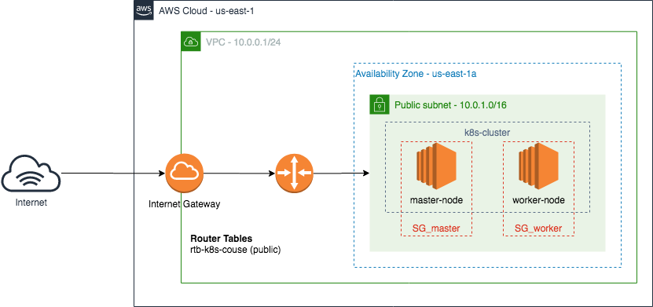

# terraform-aws-kubernetes

Criação de uma infraestrutura na AWS, via Terraform, para realização do curso Descomplicado Kubernetes da LinuxTips.

O objetivo desse repositório e facilitar a construção de uma infraestrutura na AWS para realização de treinamentos com kubernetes, onde é necessário a criação de alguns componentes, inclusive destroir eles diversas vezes para evitar cobranças.



## Necessidades para maioria dos treinamentos
* 3 instancias EC2 (1-master e 2-workers)
* Ubuntu
* 2 core CPU
* 2GB de memória RAM

## Portas necessárias para o cluster

### Master Node
| Service                 | Port      | Protocol |
|-------------------------|-----------|----------|
| kube-apiserver          | 6443      | TCP      |
| etcd server API         | 2379-2380 | TCP      |
| Kubelet API             | 10250     | TCP      |
| kube-scheduler          | 10251     | TCP      |
| kube-controller-manager | 10252     | TCP      |
| Kubelet API Read-only   | 10255     | TCP      |

### Workers
| Service               | Port        | Protocol |
|-----------------------|-------------|----------|
| Kubelet API           | 10250       | TCP      |
| Kubelet API Read-only | 10255       | TCP      |
| NodePort Services     | 30000-32767 | TCP      |

No caso, vamos utilizar o Weave como pod network, sendo assim também vamos liberar as seguintes portas:

| Service | Port      | Protocol |
|---------|-----------|----------|
| Weave   | 6783      | TCP      |
| Weave   | 6783-6784 | UDP      |

## Recursos criados
* 1 VPC
* 2 Security Groups (master e workers)
  * Egress 0.0.0.0/0
  * Ingress 22 [0.0.0.0/0] (deve mudar isso para seu IP!)
  * Ingress 80 [0.0.0.0/0]
  * Portas necessárias para o cluster (dentro da VPC)
* 1 Public subnet
* 1 Internet Gateway
* 3 instancias EC2 (t3.small padrão)
* Instalação do docker e k8s

## Como iniciar
Após clonar o repositório, deve-se executar o comando abaixo para criação do par de chaves para AWS, com ela é possivel se conectar via SSH nas máquinas posteriormente.

```
ssh-keygen -f k8s-course-key
```

Obs. Caso queira utilizar uma já existente, basta modificar o nome no arquivo `variables.tf` e referenciar no arquivo `main.tf` para conexão durante o provisionamento.

Com isso, podemos criar nossa infraestrutura.

``` bash
terraform init
terraform plan -out terraform.out
terraform apply terraform.out
```

## Após execução acessar as máquinas e executar os seguintes comandos
1. Fazer o pull das imagens
```
kubeadm config images pull
```

2. Comando para iniciar o cluster (executar no master)
```
kubeadm init --apiserver-advertise-address $(hostname -i)
```

3. Criar o podnetwork
```
kubectl apply -f "https://cloud.weave.works/k8s/net?k8s-version=$(kubectl version | base64 | tr -d '\n')"
```

4. Adicionar os demais nodes
```
kubeadm join --token <TOKEN> IP_DO_MASTER:6443 --discovery-token-ca-cert-hash sha:256:37092
```

5. Verifica os nodes
```
kubectl get nodes
````

Pronto!